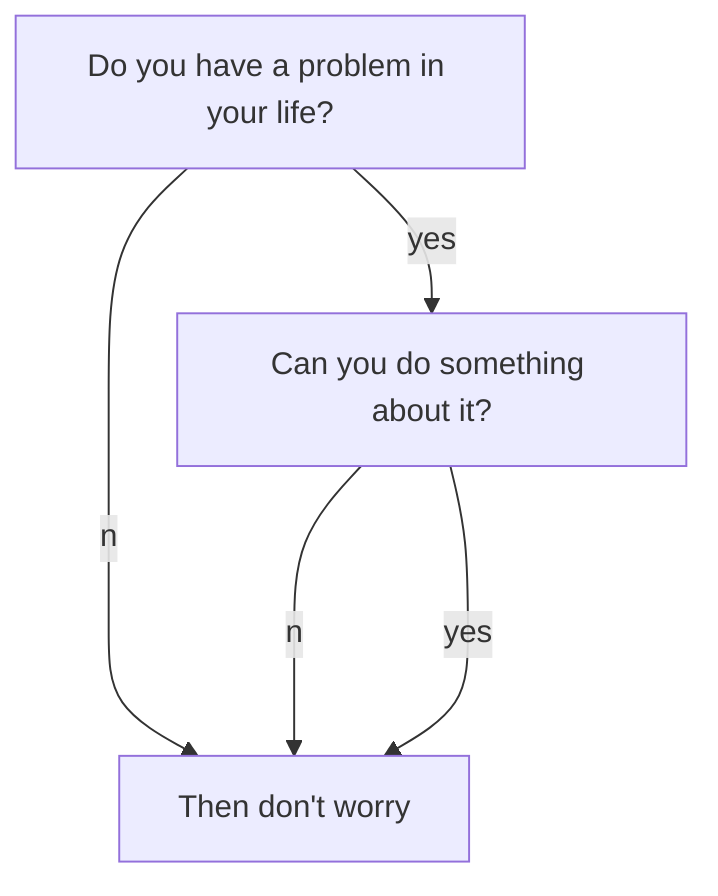

Defence in Depth is more than deploying firewalls, IPS and antivirus software,

To implement this principle, a layered "cross-boundary" approach must be taken.

The sensitive data of our company lays at the core of this layered "onion"

<figure class="wp-block-image">

{:.border.rounded}

# L Title

## M Title

### S Title

#### XS title

##### XSS title

*Italic Comment*

*Italic comment between ** Now this is italic again ** continues to be italic*
Normal text

*More italic*
Normal **Negritas** Normal

## Diagrama Mermaid
