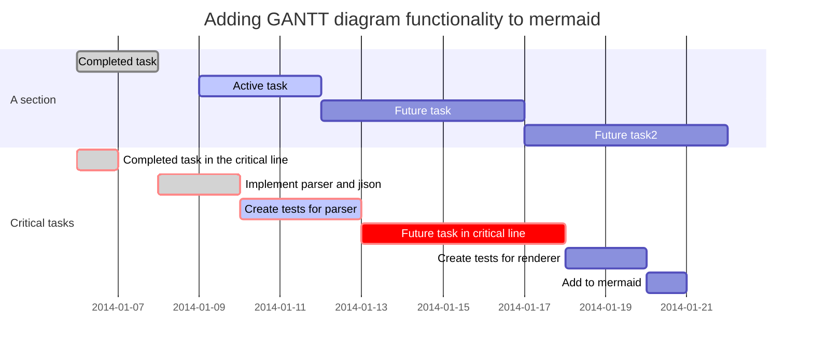

<!--more-->

---

### CodePen

<div></div>


### SlideShare

<div></div>

### bilibili (哔哩哔哩)

<div></div>

### SoundCloud

<div></div>


When $$a \ne 0$$, there are two solutions to $$ax^2 + bx + c = 0$$ and they are

$$x_1 = {-b + \sqrt{b^2-4ac} \over 2a}$$

$$x_2 = {-b - \sqrt{b^2-4ac} \over 2a} \notag$$

<!--more-->

You need set `mathjax: true` in the *_config.yml* or the markdown’s front matter to **enable** it.
{:.warning}

**After MathJax enabled**, you can set `mathjax_autoNumber: true` to have equations be numbered automatically, You can use `\notag` or `\nonumber` to prevent individual equations from being numbered.
{:.info}

[Documentation](https://tianqi.name/jekyll-TeXt-theme/docs/en/markdown-enhancements#mathjax)

**markdown:**

```tex
When $$a \ne 0$$, there are two solutions to $$ax^2 + bx + c = 0$$ and they are
$$x_1 = {-b + \sqrt{b^2-4ac} \over 2a}$$
$$x_2 = {-b - \sqrt{b^2-4ac} \over 2a} \notag$$
```

**front matter:**

    ---
    ...
    mathjax: true
    mathjax_autoNumber: true
    ---


## Gant Diagrams




```chart
{
  "type": "line",
  "data": {
    "labels": [
      "January",
      "February",
      "March",
      "April",
      "May",
      "June",
      "July"
    ],
    "datasets": [
      {
        "label": "# of bugs",
        "fill": false,
        "lineTension": 0.1,
        "backgroundColor": "rgba(75,192,192,0.4)",
        "borderColor": "rgba(75,192,192,1)",
        "borderCapStyle": "butt",
        "borderDash": [],
        "borderDashOffset": 0,
        "borderJoinStyle": "miter",
        "pointBorderColor": "rgba(75,192,192,1)",
        "pointBackgroundColor": "#fff",
        "pointBorderWidth": 1,
        "pointHoverRadius": 5,
        "pointHoverBackgroundColor": "rgba(75,192,192,1)",
        "pointHoverBorderColor": "rgba(220,220,220,1)",
        "pointHoverBorderWidth": 2,
        "pointRadius": 1,
        "pointHitRadius": 10,
        "data": [
          65,
          59,
          80,
          81,
          56,
          55,
          40
        ],
        "spanGaps": false
      }
    ]
  },
  "options": {}
}
```


## Radar Chart

```chart
{
  "type": "radar",
  "data": {
    "labels": [
      "Eating",
      "Drinking",
      "Sleeping",
      "Designing",
      "Coding",
      "Cycling",
      "Running"
    ],
    "datasets": [
      {
        "label": "My First dataset",
        "backgroundColor": "rgba(179,181,198,0.2)",
        "borderColor": "rgba(179,181,198,1)",
        "pointBackgroundColor": "rgba(179,181,198,1)",
        "pointBorderColor": "#fff",
        "pointHoverBackgroundColor": "#fff",
        "pointHoverBorderColor": "rgba(179,181,198,1)",
        "data": [
          65,
          59,
          90,
          81,
          56,
          55,
          40
        ]
      },
      {
        "label": "My Second dataset",
        "backgroundColor": "rgba(255,99,132,0.2)",
        "borderColor": "rgba(255,99,132,1)",
        "pointBackgroundColor": "rgba(255,99,132,1)",
        "pointBorderColor": "#fff",
        "pointHoverBackgroundColor": "#fff",
        "pointHoverBorderColor": "rgba(255,99,132,1)",
        "data": [
          28,
          48,
          40,
          19,
          96,
          27,
          100
        ]
      }
    ]
  },
  "options": {}
}
```

**markdown:**

    ```chart
    {
      "type": "radar",
      "data": {
        "labels": [
          "Eating",
          "Drinking",
          "Sleeping",
          "Designing",
          "Coding",
          "Cycling",
          "Running"
        ],
        "datasets": [
          {
            "label": "My First dataset",
            "backgroundColor": "rgba(179,181,198,0.2)",
            "borderColor": "rgba(179,181,198,1)",
            "pointBackgroundColor": "rgba(179,181,198,1)",
            "pointBorderColor": "#fff",
            "pointHoverBackgroundColor": "#fff",
            "pointHoverBorderColor": "rgba(179,181,198,1)",
            "data": [
              65,
              59,
              90,
              81,
              56,
              55,
              40
            ]
          },
          {
            "label": "My Second dataset",
            "backgroundColor": "rgba(255,99,132,0.2)",
            "borderColor": "rgba(255,99,132,1)",
            "pointBackgroundColor": "rgba(255,99,132,1)",
            "pointBorderColor": "#fff",
            "pointHoverBackgroundColor": "#fff",
            "pointHoverBorderColor": "rgba(255,99,132,1)",
            "data": [
              28,
              48,
              40,
              19,
              96,
              27,
              100
            ]
          }
        ]
      },
      "options": {}
    }
    ```

## Polar Area Chart

```chart
{
  "type": "polarArea",
  "data": {
    "datasets": [
      {
        "data": [
          11,
          16,
          7,
          3,
          14
        ],
        "backgroundColor": [
          "#FF6384",
          "#4BC0C0",
          "#FFCE56",
          "#E7E9ED",
          "#36A2EB"
        ],
        "label": "My dataset"
      }
    ],
    "labels": [
      "Red",
      "Green",
      "Yellow",
      "Grey",
      "Blue"
    ]
  },
  "options": {}
}
```

**markdown:**

    ```chart
    {
      "type": "polarArea",
      "data": {
        "datasets": [
          {
            "data": [
              11,
              16,
              7,
              3,
              14
            ],
            "backgroundColor": [
              "#FF6384",
              "#4BC0C0",
              "#FFCE56",
              "#E7E9ED",
              "#36A2EB"
            ],
            "label": "My dataset"
          }
        ],
        "labels": [
          "Red",
          "Green",
          "Yellow",
          "Grey",
          "Blue"
        ]
      },
      "options": {}
    }
    ```

## Pie Chart

```chart
{
  "type": "pie",
  "data": {
    "labels": [
      "Red",
      "Blue",
      "Yellow"
    ],
    "datasets": [
      {
        "data": [
          300,
          50,
          100
        ],
        "backgroundColor": [
          "#FF6384",
          "#36A2EB",
          "#FFCE56"
        ],
        "hoverBackgroundColor": [
          "#FF6384",
          "#36A2EB",
          "#FFCE56"
        ]
      }
    ]
  },
  "options": {}
}
```

**markdown:**

    ```chart
    {
      "type": "pie",
      "data": {
        "labels": [
          "Red",
          "Blue",
          "Yellow"
        ],
        "datasets": [
          {
            "data": [
              300,
              50,
              100
            ],
            "backgroundColor": [
              "#FF6384",
              "#36A2EB",
              "#FFCE56"
            ],
            "hoverBackgroundColor": [
              "#FF6384",
              "#36A2EB",
              "#FFCE56"
            ]
          }
        ]
      },
      "options": {}
    }
    ```

## Doughnut Chart

```chart
{
  "type": "doughnut",
  "data": {
    "labels": [
      "Red",
      "Blue",
      "Yellow"
    ],
    "datasets": [
      {
        "data": [
          300,
          50,
          100
        ],
        "backgroundColor": [
          "#FF6384",
          "#36A2EB",
          "#FFCE56"
        ],
        "hoverBackgroundColor": [
          "#FF6384",
          "#36A2EB",
          "#FFCE56"
        ]
      }
    ]
  },
  "options": {}
}
```

**markdown:**

    ```chart
    {
      "type": "doughnut",
      "data": {
        "labels": [
          "Red",
          "Blue",
          "Yellow"
        ],
        "datasets": [
          {
            "data": [
              300,
              50,
              100
            ],
            "backgroundColor": [
              "#FF6384",
              "#36A2EB",
              "#FFCE56"
            ],
            "hoverBackgroundColor": [
              "#FF6384",
              "#36A2EB",
              "#FFCE56"
            ]
          }
        ]
      },
      "options": {}
    }
    ```

## Bubble Chart

```chart
{
  "type": "bubble",
  "data": {
    "datasets": [
      {
        "label": "First Dataset",
        "data": [
          {
            "x": 20,
            "y": 30,
            "r": 15
          },
          {
            "x": 40,
            "y": 10,
            "r": 10
          }
        ],
        "backgroundColor": "#FF6384",
        "hoverBackgroundColor": "#FF6384"
      }
    ]
  },
  "options": {}
}
```

**markdown:**

    ```chart
    {
      "type": "bubble",
      "data": {
        "datasets": [
          {
            "label": "First Dataset",
            "data": [
              {
                "x": 20,
                "y": 30,
                "r": 15
              },
              {
                "x": 40,
                "y": 10,
                "r": 10
              }
            ],
            "backgroundColor": "#FF6384",
            "hoverBackgroundColor": "#FF6384"
          }
        ]
      },
      "options": {}
    }
    ```


# H1. TeXt Heading

## H2. TeXt Heading

### H3. TeXt Heading

#### H4. TeXt Heading

##### H5. TeXt Heading

###### H6. TeXt Heading

<!--more-->

**markdown:**

    # H1. TeXt Heading
    ## H2. TeXt Heading
    ### H3. TeXt Heading
    #### H4. TeXt Heading
    ##### H5. TeXt Heading
    ###### H6. TeXt Heading

H1. TeXt Heading
==================

H2. TeXt Heading
------

**markdown:**

    H1. TeXt Heading
    ==================

    H2. TeXt Heading
    ------


*Should Old Acquaintance be forgot*

_Should Old Acquaintance be forgot_

**Should Old Acquaintance be forgot**

__Should Old Acquaintance be forgot__

<!--more-->

**markdown:**

    *Should Old Acquaintance be forgot*
    _Should Old Acquaintance be forgot_
    **Should Old Acquaintance be forgot**
    __Should Old Acquaintance be forgot__

---

This is a ***text with light and strong emphasis***.

This **is _emphasized_ as well**.

This *does _not_ work*.

This **does __not__ work either**.

**markdown:**

```
This is a ***text with light and strong emphasis***.
This **is _emphasized_ as well**.
This *does _not_ work*.
This **does __not__ work either**.
```


An :apple: a day, keeps :woman_health_worker: :man_health_worker: away.

<!--more-->

**markdown:**

    

## With ALT


**markdown:**

    

## With Title


**markdown:**

    

## Specify Width and Height

{:width="128px" height="128px"}

**markdown:**

    {:width="128px" height="128px"}

---

{:width="64px" height="64px"}

**markdown:**

    {:width="64px" height="64px"}


## Unordered list

* Aenean
* vel
    * libero
    * eget
* ante

<!--more-->

**markdown:**

    * Aenean
    * vel
        * libero
        * eget
    * ante

## Ordered list

1. Aenean
2. vel
3. libero
4. eget
5. ante

**markdown:**

    1. Aenean
    2. vel
    3. libero
    4. eget
    5. ante

## Task list

- [ ] a bigger project
  - [x] first subtask
  - [x] follow up subtask
  - [ ] final subtask
- [ ] a separate task


> “There is nothing either good or bad, but thinking makes it so.”
>
> —Hamlet in *Hamlet*

<!--more-->

**markdown:**

    > “There is nothing either good or bad, but thinking makes it so.”
    >
    > —Hamlet in *Hamlet*

---

> “From women’s eyes this doctrine I derive:
>
> They sparkle still the right Promethean fire;
>
> They are the books, the arts, the academes,
>
> That show, contain, and nourish all the world.”
>
> —Berowne in *Love’s Labor’s Lost*

Here is a footnote reference,[^1] and another.[^longnote]

[^1]: Here is the footnote.

[^longnote]: Here’s one with multiple blocks.

    Subsequent paragraphs are indented to show that they
belong to the previous footnote.

<!--more-->

**markdown:**

    Here is a footnote reference,[^1] and another.[^longnote]

    [^1]: Here is the footnote.

    [^longnote]: Here’s one with multiple blocks.

        Subsequent paragraphs are indented to show that they
    belong to the previous footnote.