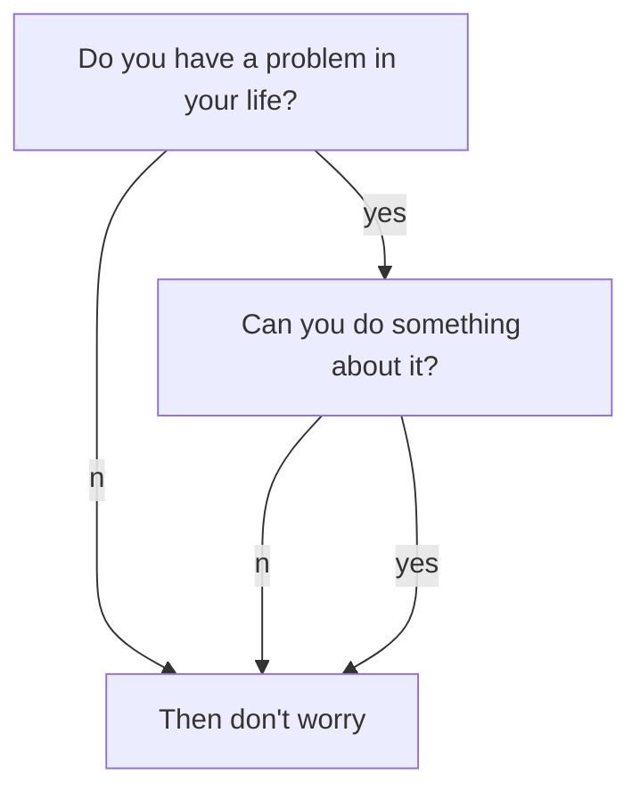

<!--more-->

---

# Large Title

## M Title

### S Title

#### XS title

##### XSS title

*Italic Comment*

*Italic comment between ** Now this is italic again ** continues to be italic*
Normal text

*More italic*
Normal **Negritas** Normal

## Diagrama Mermaid
